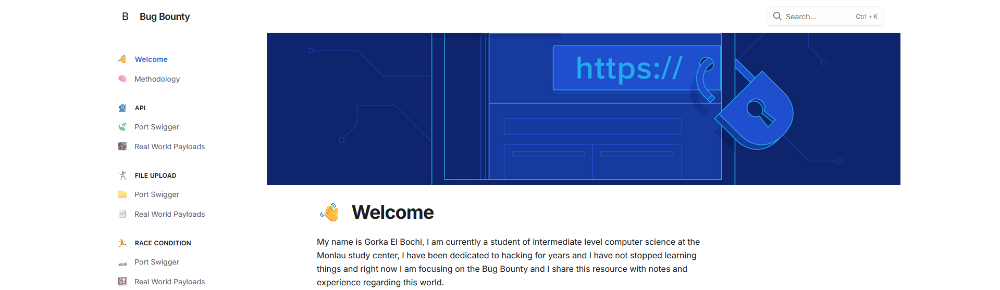

# 🕸️ Bug Bounty - Web Resource

<figure><figcaption></figcaption></figure>

On this platform, you will find exclusive notes and resources designed for the bug bounty hunter community. My goal is to create a space where you can learn, improve your skills, and access practical tools to assist you in your security investigations.

#### What can you find here?

* **Detailed notes**: Summaries and explanations of methodologies, tools, and techniques used in the world of bug bounty hunting. From basic concepts to advanced approaches.
* **Practical resources**: Scripts, cheatsheets, and templates that will save you time while working on your audits.
* **News and trends**: Articles about the latest discovered vulnerabilities and best practices to tackle them.

This site is intended to be a source of reference for both beginners and experts who want to stay up-to-date in a field that evolves rapidly.

If you want to learn, improve, and become a better bug bounty hunter, you’re in the right place. Explore the content and start growing!


